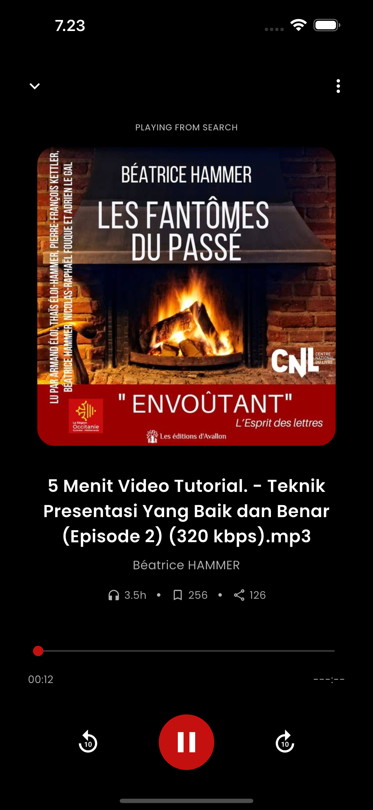

# Flutter LMS - Talent Insider

A modern Learning Management System mobile application built with Flutter, following clean architecture principles. This app allows users to browse courses, view audio books, and manage their learning journey.

## Table of Contents

- [Getting Started](#getting-started)
  - [Prerequisites](#prerequisites)
  - [Installation](#installation)
  - [Device Compatibility](#device-compatibility)
  - [Development Environment](#development-environment)
- [Architecture Overview](#architecture-overview)
  - [Clean Architecture](#clean-architecture)
  - [Folder Structure](#folder-structure)
- [Features](#features)
- [Screenshots](#screenshots)
  - [Onboarding](#onboarding)
  - [Authentication](#authentication)
  - [Home](#home)
  - [Courses](#courses)
  - [Audio Books](#audio-books)

## Getting Started

### Prerequisites

- Flutter SDK (latest stable version)
- Dart SDK
- Android Studio or VS Code
- Git

### Installation

1. Clone the repository

```bash
git clone https://github.com/yourusername/talent_insider.git
cd talent_insider
```

2. Install dependencies

```bash
flutter pub get
```

3. Generate code for freezed and json_serializable

```bash
dart run build_runner build --delete-conflicting-outputs
```

4. Run the application

```bash
flutter run
```

### Device Compatibility

> **Note:** This project has been developed and tested primarily on iOS Simulator (iPhone 15 Plus). For the best experience and to see the UI as intended, we recommend using the same device for running the application. While the app should work on other devices, the UI layout might vary slightly depending on screen dimensions.

### Development Environment

This project was built using:

- Flutter version: stable 3.24.3
- Dart SDK version: 3.5.3

## Architecture Overview

### Clean Architecture

This project follows the principles of Clean Architecture combined with Domain-Driven Design (DDD). The codebase is organized into three main layers:

1. **Domain Layer** - Contains business logic and rules independent of any framework

   - Entities: Core business objects
   - Use Cases: Business rules/logic
   - Repository Interfaces: Define contracts for data access

2. **Data Layer** - Handles data access and API communication

   - Models: DTOs for remote/local data
   - Repositories: Implementation of domain interfaces
   - Data Sources: API clients, local storage

3. **Presentation Layer** - UI and state management
   - Screens: UI components
   - Widgets: Reusable UI components
   - Bloc/Cubit: State management

### Folder Structure

```
lib/
├── core/                            # Global reusable logic
│   ├── errors/                      # Failures and exceptions
│   └── usecases/                    # Base classes for use cases
├── features/
│   ├── authentication/              # Feature: Authentication
│   │   ├── domain/
│   │   │   ├── entities/            # Pure business models
│   │   │   └── usecases/            # Business rules / interactors
│   │   ├── data/
│   │   │   ├── models/              # DTOs for remote/local APIs
│   │   │   └── repositories/        # Implement domain contracts
│   │   └── presentation/
│   │       ├── bloc/                # Bloc/Cubit logic
│   │       └── screens/             # UI screens
│   ├── courses/                     # Feature: Courses
│   ├── audio_book/                  # Feature: Audio Books
│   ├── home/                        # Feature: Home
│   └── onboarding/                  # Feature: Onboarding
├── router/                          # App navigation
│   └── app_router.dart              # Router configuration
├── di/                              # Dependency injection
│   └── injection_container.dart     # Service locator
└── main.dart                        # App entry point
```

## Features

- **Onboarding**: Introduce users to the app's key features
- **Authentication**: User login and registration
- **Home**: Dashboard displaying featured content
- **Courses**: Browse, search, and view detailed course information
- **Audio Books**: Access and play educational audio content

## Screenshots

### Onboarding

<div style="display: flex; flex-direction: row; flex-wrap: wrap; gap: 10px; justify-content: center;">
  
  
  
</div>

### Authentication

<div style="display: flex; justify-content: center;">
  
</div>

### Home

<div style="display: flex; justify-content: center;">
  
</div>

### Courses

<div style="display: flex; flex-direction: row; flex-wrap: wrap; gap: 10px; justify-content: center;">
  
  
  
  
</div>

### Audio Books

<div style="display: flex; flex-direction: row; gap: 10px; justify-content: center;">
  
  
</div>
